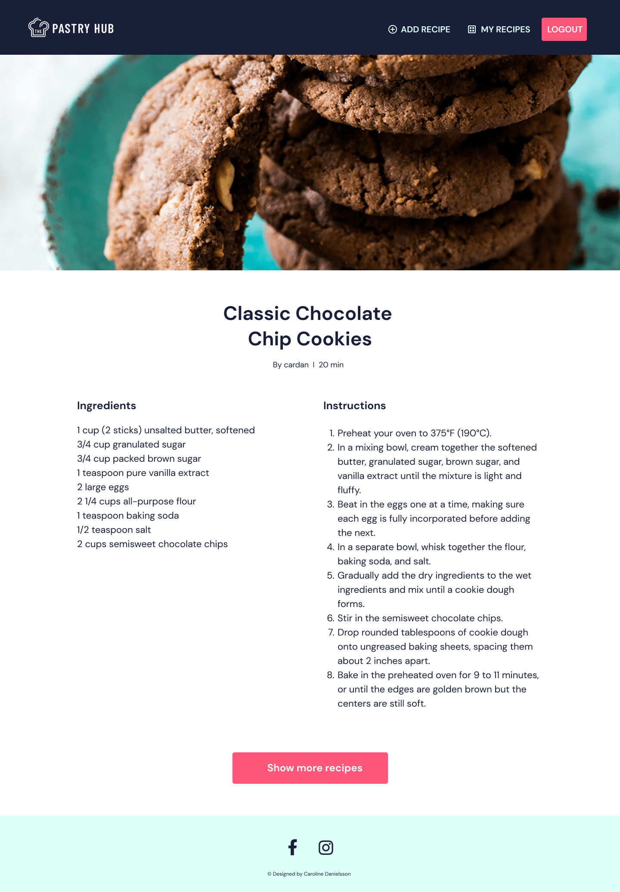
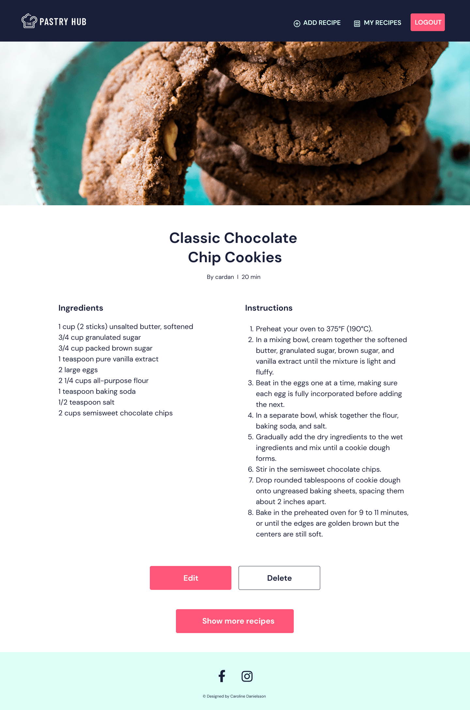
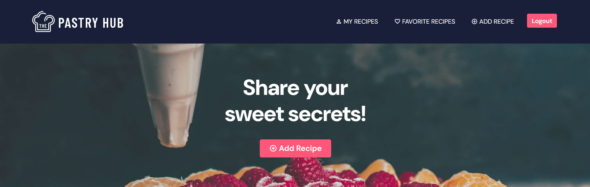
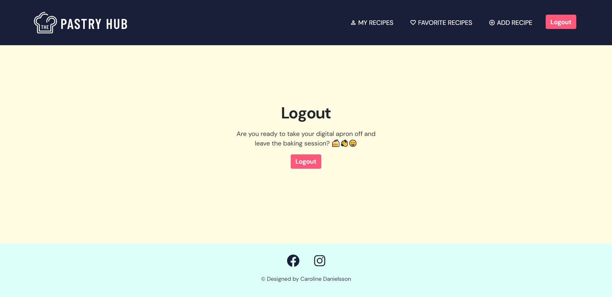
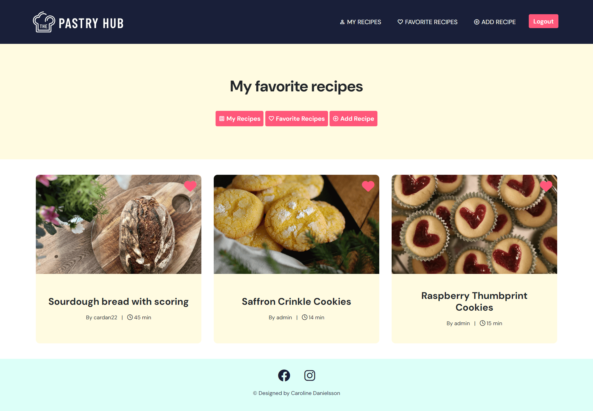
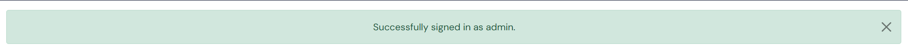

# The Pastry Hub
Link to the website: [The Pastry Hub](https://pastryhub-a26ff900b5cc.herokuapp.com/)

## Table of Content

- [The Pastry Hub](#the-pastry-hub)
  - [Table of Content](#table-of-content)
  - [About](#about)
  - [Project Goals](#project-goals)
  - [User Experience - UX](#user-experience---ux)
    - [Strategy](#strategy)
    - [Scope](#scope)
    - [Structure](#structure)
    - [Skeleton](#skeleton)
    - [Surface](#surface)
  - [Agile Development](#agile-development)
    - [Conclusion](#conclusion)
  - [Existing Features](#existing-features)
  - [Future Features](#future-features)
  - [Technologies Used](#technologies-used)
    - [Languages](#languages)
    - [Python Modules \& Packages](#python-modulespackages-used)
    - [Frameworks \& Tools](#frameworks--tools)
  - [Testing and Validation](#testing-and-validation)
  - [Deployment \& Development](#deployment--development)
  - [Credits](#credits)
    - [Media](#media)
    - [Code](#code)

## About
The Pastry Hub is a website dedicated to the delightful world of pastries. Here, you can freely share your most beloved pastry recipes, each offering a step-by-step guide to crafting delectable sweet treats. Creating an account grants you the freedom to add, modify, or delete your recipes at your convenience.

The platform is designed with a warm and inviting atmosphere, bringing together individuals who share a passion for baking and savoring sweet delicacies. It's a friendly community where like-minded baking enthusiasts can connect and exchange their finest pastry recipes, making it a perfect destination for all lovers of the culinary arts. Join us to explore the joy of creating and indulging in delightful pastries!

## Project goals
The project's main goal was to create a user-friendly platform for effortlessly uploading and sharing your favorite recipes. It also allowed users to build their own special recipe collections, making it simple to gather and organize their preferred recipes for sharing and quick access. By creating an account, users gained the ability to add, modify, or delete their recipes whenever they wished.

In summary, this project aimed to be a welcoming space for culinary enthusiasts to not only share their passion for food but also to curate their collection of cherished recipes. With a strong emphasis on user-friendliness and personalization, the platform strived to nurture a lively community of food lovers who could easily connect, exchange ideas, and explore a world of delightful flavors.

## User Experience - UX
The application was created with a focus on the Five Planes of User Experience.

### Strategy
**EPIC: Content and navigation**
| ID | User Story |
| -- | ---------- |
| 1A | As a site visitor, I can access a navigation menu, so I can easily explore the website. |
| 1B | As a visitor, I can find relevant information about the site, so that I can decide if I want to create an account. |
| 1C | As a user, I can access an intuitive and visually pleasing design so that it aligns with the site's purpose. |
| 1D | As a user, I can smoothly access different site pages so that I can make the most of all the site's features. |

**EPIC: Registration and user accounts**
| ID | User Story | 
| -- | ---------- |
| 2A | As a new user, I can register for an account so that I can access the website's features. |
| 2B | As a registered user, I can log into my account so that I can access my account information. |
| 2C | As a logged-in user, I can log out of my account with ease so that I can protect my account information. | 
| 2D | As a user, I can reset my password so that I can regain access to my account if I forget it. | 

**EPIC: Managing recipes**
| ID | User Story |
| -- | ---------- |
| 3A | As a site user, I can add a recipe so that I can share it on the site. | 
| 3B | As a site user, I can edit and delete my recipes so that I can make adjustments or remove recipes as necessary. |
| 3C | As a user, I can like recipes that I enjoy, so that I can bookmark my favorite recipes. | 
| 3D | As a site user, I can comment on recipes so that I can share my thoughts or tips with other users. |

**EPIC: User views**
| ID | User Story | 
| -- | ---------- | 
| 4A | As a user, I can view the detail of each recipe so that I can learn how to bake them. |
| 4B | As a user, I can view all my recipe entries so that I can easily see and access my own content for editing. |
| 4C | As a registered user, I can see a list of all the recipes I've liked on my profile page so that I can easily access and revisit my favorite recipes. |
| 4D | As a user, I want to receive feedback on my actions so that I know whether they were successful or not. |

#### Target Audience
The Pastry Hub is meant for people who love baking. It's a place where they can easily write down and share their best pastry recipes. Whether you're a beginner or a pro, it's for anyone who enjoys baking.

#### User Requirements and Expectations
* Easy-to-use website with simple navigation.
* Access to all site functions without any hassle.
* Links and features work smoothly.
* Instant feedback when using the website's features.
* A nice-looking design that works well on different devices.
* Accessibility.

### Scope

#### Simple and intuitive User Experience:
* Ensure the menu is easy to find and works properly.
* Make sure the page names match what they're about.
* Give users clear visual cues as they use the site's features.
* Create a design that fits the purpose of each page.

#### Relevant Content:
* Include information about the site's purpose to help users understand what it's all about.
* Feature user-generated content on the homepage to give new users an idea of what the site is for.

#### Core Website Functions:
* Build the essential features that let users interact with the site.
* Set up registration, login, and logout features to access the core functions.
* Create a form for adding new content to the site.
* Develop features that allow users to edit and delete their content.

#### Responsive Design:
* Make sure the site works well on desktops, tablets, and mobile devices for a smooth user experience.

### Structure

#### Current/Initial Structure
* **Home page:** Both users who haven't registered and those who have registered can view the content on the homepage, which includes a list of recipes to explore. Unregistered users will encounter a button prompting them to login to add a recipe, while registered users will see the button to add recipe.
* **Register page:** The Register Page enables users to make an account so they can use the main features of the website.
* **Login/Logout page:** Users can log in to their accounts to access all site features. The logout option is available here as well.
* **Recipe detail page:** The Recipe Detail Page enables users to see all the specifics of a pastry recipe. If a user is logged in and it's their own recipe, they'll find buttons to edit or delete it.
* **Add recipe page:** This page allows users to submit their own pastry recipes, complete with a title, baking time, ingredients, instructions, an image, and a status of either 'draft' or 'published'
* **Update recipe:** Users can edit or make changes to their existing pastry recipes on this page.
* **Delete recipe:** This feature enables users to delete their pastry recipes from the platform. Users will be prompted with a confirmation message on this page to ensure they are certain about removing the recipe.
* **User’s recipe page:** Users can view a collection of all their submitted pastry recipes, neatly organized for easy access. They can also see a 'draft' tag on recipes that have not been published yet.
* **Favorite recipe page:** Users can access recipes they have marked as favorites, organized neatly for easy access.

### Skeleton

#### Wireframes
I used Figma to design wireframes, which helped me to create a visual representation of The Pastry Hub.

1. **Home page**

Desktop

Mobile view

2. **Recipe detail page**

Unauthorized User Desktop

Unauthorized User Mobile view

Authorized User Desktop

Authorized User Mobile view

3. **My Recipes page**

Desktop

Mobile view

4. **Add Recipes page**

Desktop

Mobile view

5. **Sign up page**

Desktop

Mobile view

6. **Login page**

Desktop

Mobile view

### Surface

#### Data Base Design
The Entity Relationship Diagram (ERD) shows how the database is organized at the heart of the site's features.

**User Model:** Django provides a User Model, which serves as the foundation for user accounts on the platform. Users can register and manage their profiles using this model.

**Recipe Model:** The Recipe Model is the heart of the platform, allowing users to create, store, and share their pastry recipes. Each user has the flexibility to add multiple recipes, each with its own unique details. These details include the recipe's title, author, estimated baking time, step-by-step instructions, a list of ingredients, an image to visually represent the dish, image alt text for accessibility, the recipe's status (such as published or draft), and the date it was posted.

**FavoriteRecipe Model:** Users can add their favorite recipes to the FavoriteRecipe Model. This model establishes a relationship between users and the recipes they adore. It provides a means for users to curate their personal collection of beloved recipes.

 **Future Models:**

In the pipeline for future development is the **Comment model**. This feature will enhance the interactive aspect of the platform by allowing users to leave comments on recipes. It will foster a sense of community among users, encouraging discussions, feedback, and shared experiences related to the culinary delights created and enjoyed by the community.

#### Colours
I wanted the page to have an inviting and playful feel that reflects the deliciousness of the recipes. However, I didn't want the colors to be too overpowering, considering the page contains numerous images of various pastries.

#### Typography
I used DM Sans font To make The Pastry Hub visually appealing and easy to read. My goal was to create a pleasant and easy-to-read text style that goes well with the overall design.

#### Logo
I created a simple logo for The Pastry Hub to strengthen its visual identity. The logo is minimalistic and easy to understand, making it easier for users to recognize and associate with The Pastry Hub.

## Agile Development
The development of this project was managed through GitHub issues, milestones, and projects. 
[Link to The Pastry Hub User Stories](https://github.com/users/cardan22/projects/4)

### Sprints
The project adopted an Agile development approach, breaking down the development process into several sprints. Each sprint had a specific focus and objectives:

**Sprint 1: Project Installation and Configuration (Oct 2 - Oct 3, 2023)**

In the first sprint, the project commenced with the basic installation and configuration of components. This involved setting up views, templates, and connecting URLs, as well as registering models, establishing the foundational structure of the project.

**Sprint 2: Interface Design and User Story Templates (Oct 6 - Oct 10, 2023)**

The second sprint focused on designing the interface for the website, with a specific emphasis on login, logout, and registration pages. User management systems were integrated, enhancing the user experience.

**Sprint 3: Recipe-Related Functionality and User Interface (Oct 13 - Oct 17, 2023)**

Sprint 3 included the implementation of critical recipe-related functionality, such as the ability to delete and update recipes. A new model for favorite recipes was added, and a new template to display detailed recipe information was created.

**Sprint 4: UI Enhancements, User Experience, and Style Improvements (Oct 20 - Oct 30, 2023)**

In the fourth sprint, work was focused on improving the user interface and overall user experience. This included creating an appealing hero section with content and making minor adjustments to enhance usability.

**Sprint 5: Testing, Final Code Revisions, and Documentation (Oct 30 - Nov 7, 2023)**

The final sprint centered on testing the code and conducting final revisions. Project documentation was completed, and the last refinements were made to ensure the project's quality and completeness.

## Conclusion

The Pastry Hub is a web application that I designed for pastry enthusiasts to share their favorite recipes and connect with like-minded bakers. I am delighted to share that it successfully achieved its goals, offering user-friendly features like registration and recipe management.

Agile development was the cornerstone of this project's success. Breaking down tasks into sprints allowed for a structured and organized workflow. The iterative nature of Agile enabled continuous improvement based on user feedback and evolving requirements, resulting in a more user-friendly application.

Looking forward, I aim to enhance user engagement with features like a comment section, password reset, and account deletion. The Pastry Hub is a community that invites all baking enthusiasts to come together, celebrate their passion, and share delightful recipes.

## Features

### Existing Features

#### Header and logo
* The section displays a logo along with the header text.
* Helps the user to quickly recognize and connect the website with its specific content and purpose.
* Different links are shown to users depending on whether they are logged in or not. 
* On smaller screens, the navigation links become a collapsible burger menu for a user-friendly experience.,

- **Default navbar and header for unregistered user**

- **Navbar and header for registered user**

- **Navbar on mobile**

- **Navbar expanded on mobile**

#### Footer section
* The footer includes links to Instagram and Facebook, along with a copyright feature.

#### Account Features

##### Create an Account
* Allows User Signup
* Fields: Username, Email, Password, Password Confirmation

##### Login to an Account
* Allows User Access to Their Information

##### Log Out of an Account
* Allows User to Log Out

### Main Views

#### Home Page
* Home page consists of two separate interfaces: one for registered users and one for unregistered visitors.
* Unregistered users are greeted with an inviting hero image and a call to action, encouraging them to 'log in to add a recipe.'
* The homepage features a paginated list of publicly available recipes.
* For logged-in users, there's a straightforward option to 'add a recipe.'
* for logged-in users, a heart icon is displayed on recipe cards. Clicking the heart icon adds the recipe to their favorites, and clicking it again removes it from the favorites

- **Desktop View Unregistered Users**

- **Mobile View Desktop for Registered Users**

#### My Recipes
* Allows registered users to view their recipes, including drafts.

* Recipes with a 'draft' status are displayed as 'draft' recipes.

#### Favorite Recipes
* Allows registered users to view their favorite recipes
* When the user clicks the heart icon, the recipe is removed from the favorite recipes.

#### Recipe Detail View
* The Recipe Detail view allows both registered and unregistered users to view recipe details by clicking on the recipe card.
* The image is displayed prominently in the header.
* Below the header, the recipe's title, author, and baking time are shown.
* Ingredients and instructions are displayed further down the page.
* A button at the bottom allows users to view more recipes.
* Registered users can update or delete a recipe.
* Registered users can also mark recipes as favorites using a heart symbol, a feature exclusively available to them.

- **View for Unregistered users without the button features**

- **View for registered users with edit/delete/favorite buttons**

### CRUD Functionality 
* All CRUD functionality is only available to registered users once they are logged in.

#### Create a Recipe
* User can create a Recipe
* Form Fields: Title, Baking time, Ingredients, Instructions, Image, Image alt, Status

#### Update a Recipe
* User can update a Recipe
* Form Prefilled with Existing Details

#### Delete a Recipe
* User can delete a Recipe
* Confirmation Prompt for Deletion

#### Success messages
* After any user action on the website, a success message confirms the success of the CRUD (Create, Read, Update, Delete) operation, whether it's account-related or content-related. This list is not exhaustive.

#### 404 view
* The 404 view is designed to provide a user-friendly error page in case a requested page is not found on the website.
* This page offers a visually appealing and informative 404 error message, helping users navigate back to the site's functional pages.

## Future Features
**Comment Section**

To foster a sense of community and interaction, a comment section will be introduced for each recipe. Users will have the ability to leave comments, ask questions, and share their experiences related to the recipes. This feature aims to enhance engagement, sharing, and learning among baking enthusiasts.

**Forgot Password**

In the pursuit of a seamless user experience, a "Forgot Password" functionality will be implemented. Users who forget their passwords will have the option to reset them securely through a verified process. This feature will enhance accessibility and usability for all members of The Pastry Hub.

**Delete Account**

User empowerment is a core principle at The Pastry Hub. Therefore, a "Delete Account" option will be offered, allowing users to have control over their accounts. This feature will enable individuals to remove their profiles and associated data at any time, providing a flexible and secure user experience.

## Technologies Used

### Languages

* [HTML](https://en.wikipedia.org/wiki/HTML)
* [CSS](https://en.wikipedia.org/wiki/Cascading_Style_Sheets)
* [JavaScript](https://en.wikipedia.org/wiki/Javascript)
* [Python](https://en.wikipedia.org/wiki/Python_%28programming_language%29)

### Python Modules/Packages used

* **Django:** A high-level Python web framework that served as the foundation for building this application/site.
* ***Psycopg2:**  This package acts as a PostgreSQL database adapter for Python, enabling seamless interaction with the database.
* **dj3-cloudinary-storage:** This package simplifies integration with Cloudinary by implementing the Django Storage API, making it easier to work with media assets.
* **django-allauth:** It's a comprehensive suite of Django applications that addresses various aspects of user authentication, registration, account management, and third-party (social) account authentication.
* **django-crispy-forms:** This package enhances the rendering of Django forms, offering more control and elegance in form presentation.
* **crispy-bootstrap5:** It's a template pack for django-crispy-forms that is tailored for use with Bootstrap 5, further improving the presentation of forms.
* **richtextfield:** This package was integrated to provide a rich text editor, enabling users to create and edit content with ease.

### Frameworks & Tools
* **Django:** Utilized for building the website's backend logic and user model.
* **Gitpod:** Used for writing, developing, committing, and pushing code to the GitHub repository.
* **Heroku:** Employed for deploying the live version of the website.
* **GitHub:** Hosts the website's source code and serves as a platform for Agile development framework management through issues, milestones, and projects.
* **Bootstrap:** Applied across the site to ensure responsiveness, establish layout, and utilize predefined style elements.
* **Cloudinary:** Functions as a cloud storage solution for hosting website media and static files. It also provides tools for media manipulation and optimization.
* **Figma:** Utilized for creating wireframes and project design.
* **drawSQL:** Employed for designing the Entity-Relationship Diagram (ERD).
* **Google Fonts & Icons:** Imported custom fonts and integrated some icons into the website's design and functionality.
* **Font Awesome:** Utilized for adding icon features to the site.

## Testing and Validation
The testing documentation can be found at [TESTING.md](TESTING.md)

## Deployment & Development

### Deploy on Heroku

**To deploy your project on Heroku, follow these steps:**

**Step 1: Preparing Files**

Before you start, you need two essential files: `requirements.txt` and `Procfile`.

- Create `requirements.txt` by running this command in your terminal: `pip3 freeze --local > requirements.txt`. This file will list all the requirements.
- Next, create a file named `Procfile` and add the line: `web: gunicorn pastryhub.wsgi` to it, without any empty lines. Make sure to push both these files to your repository.

**Step 2: Creating a Heroku App**

- Log in to Heroku and go to the Dashboard.
- Click "New" and select "Create new app."
- Give your app a name and choose the region closest to you.
- Click "Create app" to confirm.

**Step 3: Setting Up a Database**

- Log in to ElephantSQL.com and access your dashboard.
- Click "Create New Instance."
- Choose a plan, give it a name, select the Tiny Turtel (Free) plan, and leave the Tags field blank.
- Select a data center near you.
- Click "Review" and confirm your details.
- Return to the ElephantSQL dashboard and click on the database instance name for your project.
- In the URL section, copy the database URL.
- Ensure that Django and Gunicorn are installed in your workspace using `pip3 install 'django<4' gunicorn`.
- Also, make sure the database infrastructure is installed by running `pip3 install dj_database_url===0.5.0 psycopg2`.
- Update the `requirements.txt` file if necessary.

**Step 4: The env.py File**

- Create an `env.py` file if you don't already have one and make sure it's included in the .gitignore file.
In the `env.py` file, add the following lines:

`import os`  
`os.environ["DATABASE_URL"] = "<copied URL from SQL database>"`  
`os.environ["SECRET_KEY"] = "<create a secret key of your own>"`  

- If you're using Cloudinary storage, add this line as well:

`os.environ["CLOUDINARY_URL"] = "<copied URL from Cloudinary account>"` 

Ensure that the environment variables are correctly imported into the `settings.py` file.

**Step 5: Setting Environment Variables on Heroku**

- On the Heroku Dashboard, select the app you created and then go to the "Settings" tab.
- Click "Reveal Config Vars."
- Add the following config vars:
* `DATABASE_URL` (copy the database URL from ElephantSQL).
* `SECRET_KEY` (copy your secret key).
- If you're using Cloudinary storage, add your personal `CLOUDINARY_URL` to these fields. Additionally, you may need the key `PORT` with a value of `8000`.

**Step 6: Connecting to GitHub and Deployment**

- On the Heroku Dashboard, select your app and go to the "Deploy" tab.
- Choose GitHub as the deployment method.
- Search for your project repository and click "Connect."
- If desired, enable automatic deploys.
- Finally, select "Deploy Branch" to watch your app being built and deployed.

### Forking the Repository

- Log in to GitHub and find the repository you want to fork.
- Above the "Settings" Tab, click the "Fork" button.
- You now have a copy of the original repository in your GitHub account, allowing you to make changes while keeping the original safe.

### Making a Local Clone

- Log in to GitHub and locate the repository you want to clone.
- Click the 'Code' dropdown above the file list.
- Copy the URL for the repository.
- Open Git Bash in your IDE.
- Change the current working directory to where you want the cloned directory.
- Type `git clone` in the CLI and then paste the URL you copied. It should look like this: `$ git clone https://github.com/yourusername/yourrepository`
- Press Enter to create your local clone.
- Don't forget to install all the required packages listed in the requirements.txt file using the command: `pip install -r requirements.txt`. This command will install them for you.

**Link to:** [The Pastry Hub Repository](https://github.com/cardan22/thepastryhub)

## Credits

### Media
* All the images uploaded by the developer for her recipes belong to the developer. Furthermore, it's important to acknowledge and give credit to the following contributors for the images used on the main site of this project:

**Images:**
* Hero image: [Unsplash - Person Holding Icing Pack](https://unsplash.com/photos/person-holding-icing-pack-f4259usPV14) (Image taken from Unsplash)
* The top mockup in the README was generated using [ami.responsivedesign.is](http://ami.responsivedesign.is/).

### Code
I drew resources and inspiration from a few different places:
- To kickstart the coding process, I referred to the Code Institute's 'I Think Therefore I Blog' Django walkthrough project.
- I found useful insights from [Django Recipe Sharing Tutorial - Dee Mc](https://www.youtube.com/watch?v=sBjbty691eI&list=PLXuTq6OsqZjbCSfiLNb2f1FOs8viArjWy&index=1)
- Numerous past projects served as valuable resources and a source of inspiration:
  - [Freefido_v2](https://github.com/amylour/FreeFido_v2) by Amy Richardson
  - [Worldtravellog](https://github.com/URiem/worldtravellog) by Ulrike Riemenschneider
  - [theRecipeCollective](https://github.com/SandraBergstrom/theRecipeCollective) by Sandra Bergström 
- During the project, I frequently visited the following websites for troubleshooting and assistance:
  - [Stack Overflow](https://stackoverflow.com/)
  - [W3 Schools](https://www.w3schools.com/)
  - [Bootstrap](https://getbootstrap.com/)

[Back to top](#the-pastry-hub)