# The Patry Hub Testing

:arrow_left: [Return to the README](README.md)

# Performance
Google Lighthouse

# Accessibility
Wave

# Code validation

## HTML Validation
The [W3C Markup Validation Service](https://validator.w3.org/) was used to validate the HTML of the website.

**HTML Results:**

Home page

Recipe Detail page

Login page

Sign up page

Logout page

Add recipe page

Update recipe page

Delete recipe page

My recipes page

Favorite recipes page

## CSS Validation
The [W3C Jigsaw CSS Validation Service](https://jigsaw.w3.org/css-validator/) was used to validate the CSS of the website.

The style.css was tested, and no errors were found.

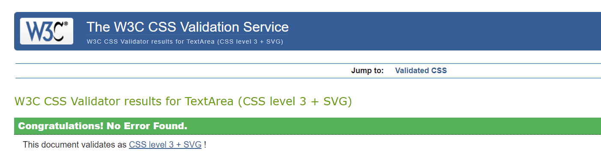

## JS Validation
[JSHint](https://jshint.com/) was used to validate the JavaScript of the website, It includes just one function located at the end of the base.html file.

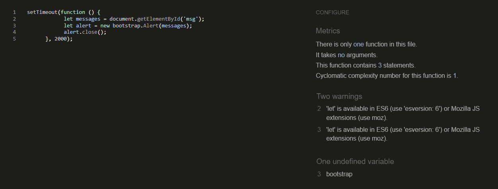

## Python validation
The Python code was tested using the [CI Python Linter](https://pep8ci.herokuapp.com/).

**Python testing results for Recipe App:**

models.py

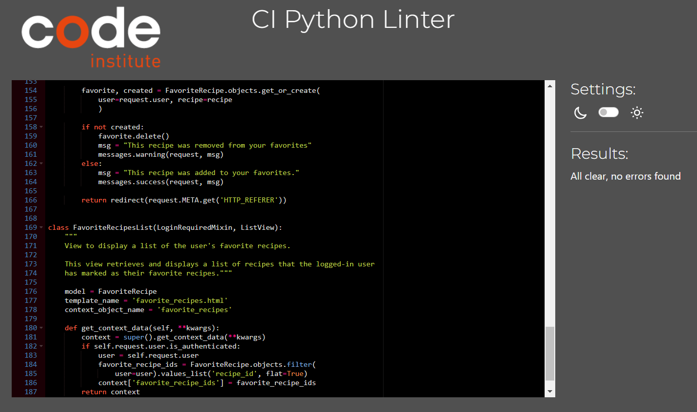

views.py

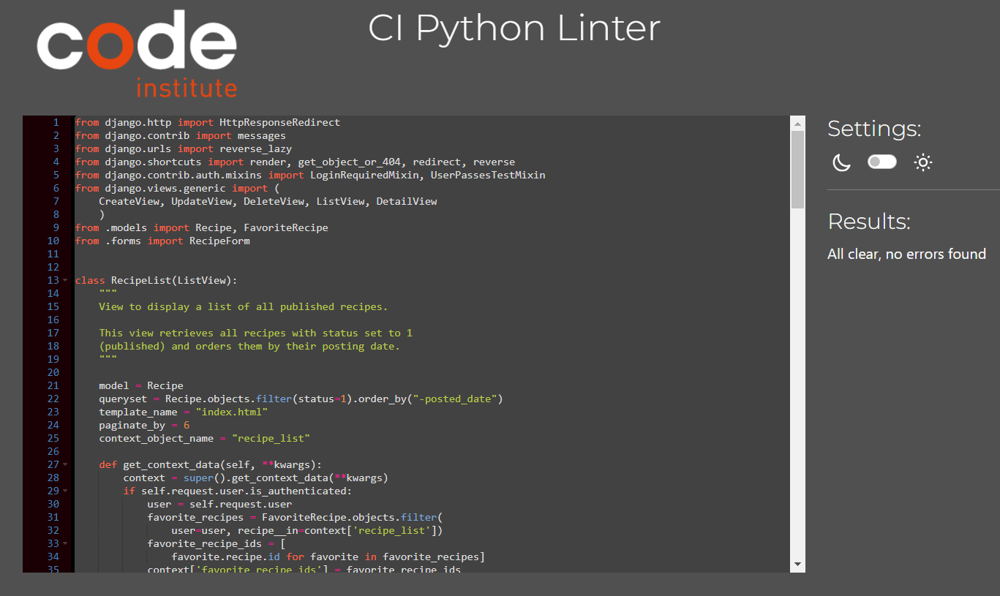

forms.py

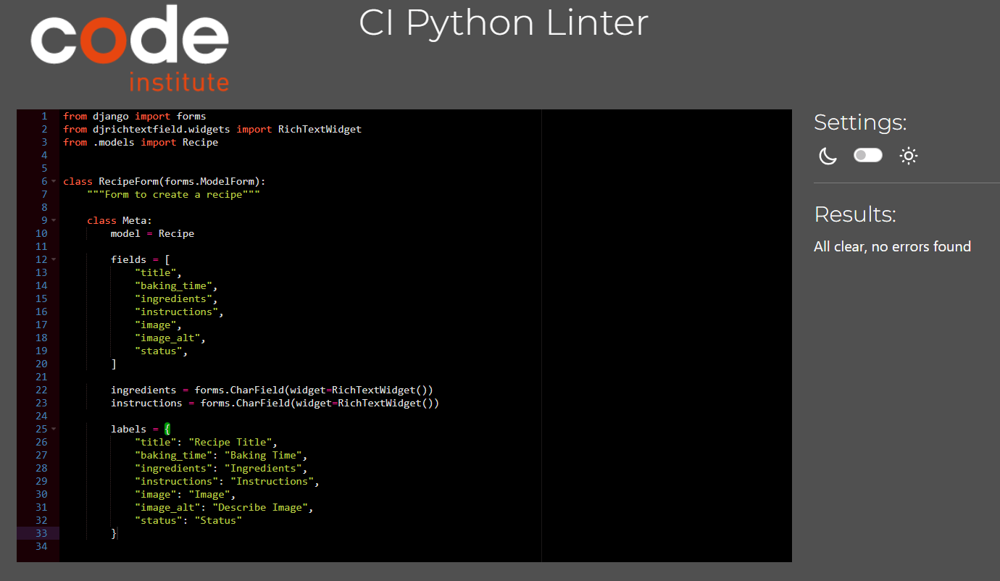

urls.py

apps.py

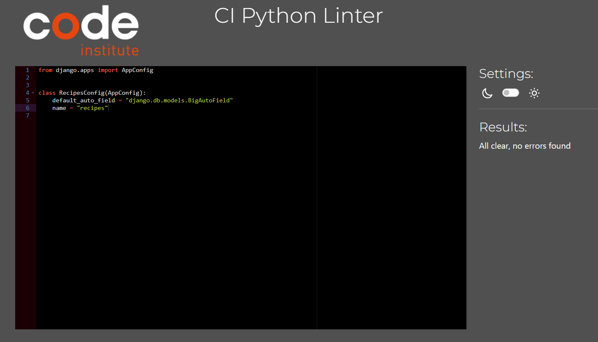

admin.py

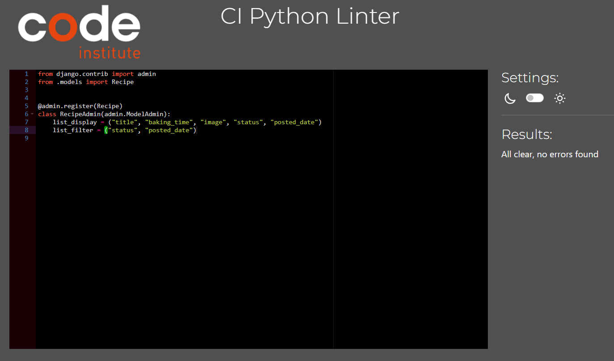

**Python testing results for pastryhub files:**

views.py

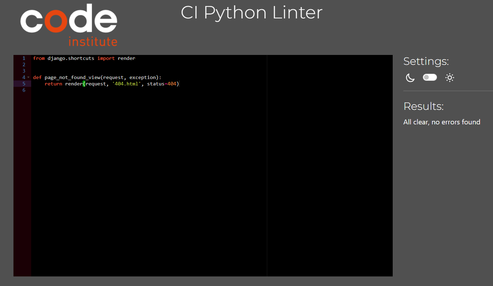

urls.py

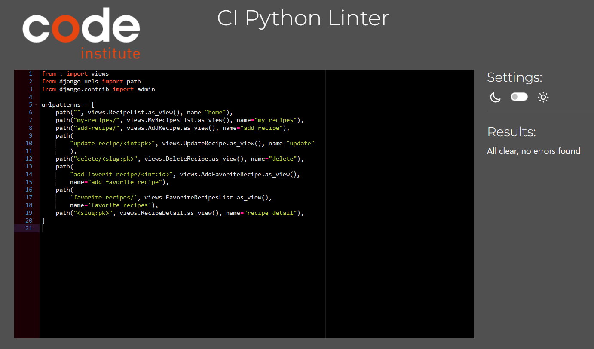

wsgi.py

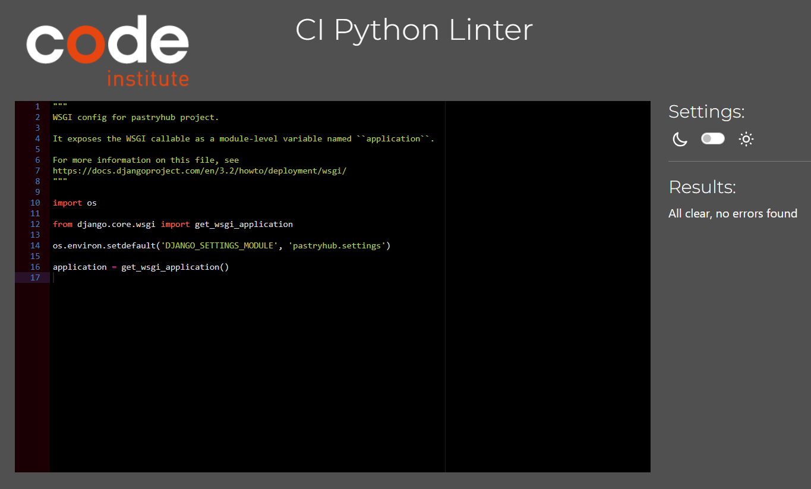

asgi.py

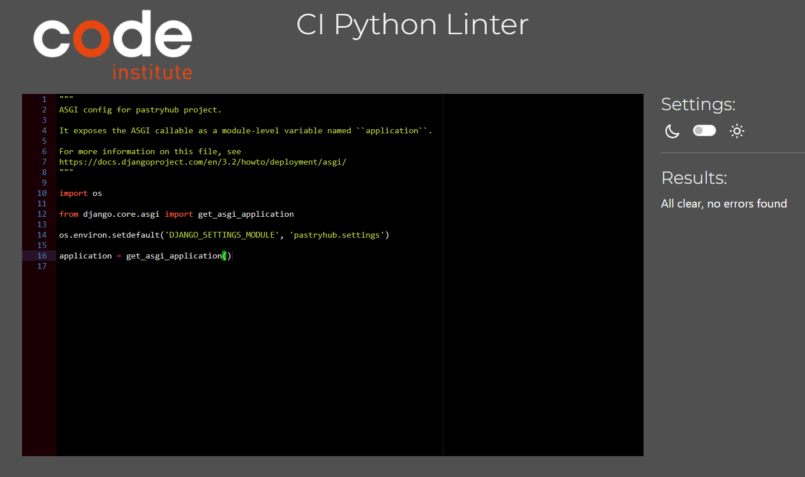

# Testing

## Manual testing
BDD, or Behaviour Driven Development, is the process used to test user stories in a non-technical way, allowing anyone to test the features of an app.

**EPIC: Content and navigation**
| ID | User Story | Action/Expected Results | Pass |
| -- | ---------- | ----------------------- | ---- |
| 1A | As a site visitor, I can access a navigation menu, so I can easily explore the website. | Site visitors can access a navigation menu, and on the home page, they will see a list of recipes. The list is paginated, showing 6 recipes at a time with an option to load more using an arrow. This allows for easy exploration of the website. The navigation bar in the header also provides links to core pages. On mobile or small screens, a burger menu icon appears, offering links to different pages. | &#x2611; |
| 1B | As a visitor, I can find relevant information about the site, so that I can decide if I want to create an account. | Unregistered users on the home page see a hero image and banner with a call to action, as well as a recipe list that communicates the site's goal. This helps users decide whether to create an account. | &#x2611; |
| 1C | As a user, I can access an intuitive and visually pleasing design so that it aligns with the site's purpose. | Access any core page of the site to explore a neatly organized collection of recipes, all presented in a clean and efficient style that clearly conveys the page's purpose. | &#x2611; |
| 1D | As a user, I can smoothly access different site pages so that I can make the most of all the site's features. | Any user can scroll to the top of any page to access the header. In the header, clear navigation options to the core pages of the site are displayed. The site is divided into pages that perform distinctly different functionalities.  | &#x2611; |

**EPIC: Registration and user accounts**
| ID | User Story | Action/Expected Results | Pass |
| -- | ---------- | ----------------------- | ---- |
| 2A | As a new user, I can register for an account so that I can access the website's features. | For an unregistered user, there will be a 'Register' link in the navigation bar. By clicking on this link, a new page opens, providing the user with the opportunity to create an account. | &#x2611; |
| 2B | As a registered user, I can log into my account so that I can access my account information. | An unregistered user can find a 'Login' link in the navigation bar, as well as a 'Login to add a recipe' prompt on the header image. By clicking on either of these, a new page will open, enabling the user to log in. | &#x2611; |
| 2C | As a logged-in user, I can log out of my account with ease so that I can protect my account information. | A registered user can access a 'Logout' link in the navigation bar. Clicking on it opens a page that prompts the user to confirm their decision to log out. | &#x2611; |

**EPIC: Managing recipes**
| ID | User Story | Action/Expected Results | Pass |
| -- | ---------- | ----------------------- | ---- |
| 3A | As a site user, I can add a recipe so that I can share it on the site. | For authenticated users, there's a 'Add recipe' link in the navigation bar. Clicking it opens a page with a form that includes various fields, such as options to publish as a draft and submit the recipe. This allows users to add and showcase their recipes on their account. | &#x2611; |
| 3B | As a site user, I can edit and delete my recipes so that I can make adjustments or remove recipes as necessary. | Authenticated users can click 'My Recipes' in the navigation bar to find and open a specific recipe they want to change. On the recipe's detail page, they will see two buttons below the recipe. One button lets them update the recipe, and the other allows them to delete it. Selecting the relevant option will either direct the user to modify the recipe details or to a confirmation screen to remove the recipe from their account | &#x2611; |
| 3C | As a user, I can like recipes that I enjoy, so that I can bookmark my favorite recipes. | Authenticated users see a heart icon on the recipes. When the user clicks on it, the recipe is added to their favorites, accessible through a link in the navbar. Clicking the heart icon again removes it from favorites. | &#x2611; |

**EPIC: User views**
| ID | User Story | Action/Expected Results | Pass |
| -- | ---------- | ----------------------- | ---- |
| 4A | As a user, I can view the detail of each recipe so that I can learn how to bake them. | Any user can explore detailed information for each recipe, enabling them to learn how to bake the recipe providing clear instructions and ingredient lists. A link is available at the page's bottom, providing easy access to a complete list of all the available recipes. | &#x2611; |
| 4B | As a user, I can view all my recipe entries so that I can easily see and access my own content for editing. | Any registered user can access the "My Recipes" page to view and manage all their recipe entries, providing easy access to their own content for editing. | &#x2611; |
| 4C | As a registered user, I can see a list of all the recipes I've liked on my profile page so that I can easily access and revisit my favorite recipes. | Authenticated users can access 'Favorite recipes' to view and manage a list of recipes they've liked, providing easy access to revisit their favorite recipes. | &#x2611; |
|4D | As a user, I want to receive feedback on my actions so that I know whether they were successful or not. | Performing any interactive action on the site, such as creating an account, logging in or out, adding, updating, deleting a recipe, or marking/unmarking a recipe as a favorite, a success message will be displayed to confirm the successful execution of the action.  | &#x2611; |

# Browser Testing

- Chrome
- Safari

# Bugs and Fixes

| **Bug**                                                                                                                                                      | **Fix**                                                                                                                                            |
| ------------------------------------------------------------------------------------------------------------------------------------------------------------ | -------------------------------------------------------------------------------------------------------------------------------------------------- |
| Navbar is sticky only on the top half of the screen.                 | Removing the html height setting at 100% resolved the issue.                    |
| Currently not showing image in the crispyform when updating the recipe.                | The issue has not been resolved yet, and the fix is pending.                     |
| The yellow background extends across the entire space, becoming visible when viewed on mobile devices. It overlays the area above the navigation bar and below the footer.                | Move the  from above the navigation to inside the main container.                    |
| Received an error 500 when trying to register a new account.               | Updated account setup by removing ACCOUNT_AUTHENTICATION_METHOD = 'username_email' ACCOUNT_EMAIL_REQUIRED = True ACCOUNT_USERNAME_REQUIRED = True ACCOUNT_USERNAME_MIN_LENGTH = 4 LOGIN_URL = '/accounts/login/' and adding LOGOUT_REDIRECT_URL = '/'.                  |